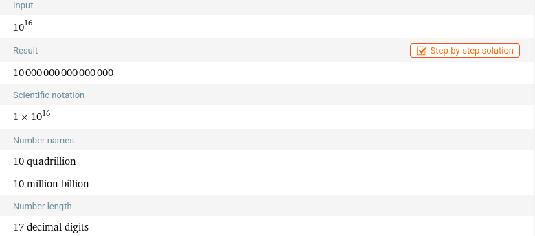
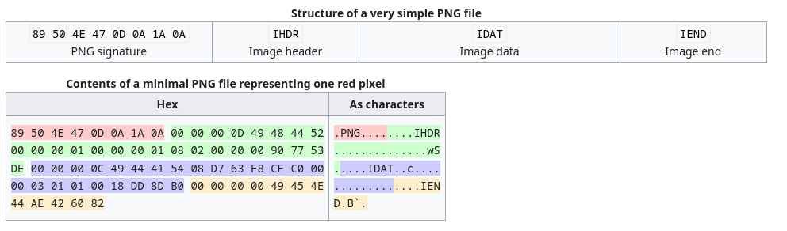
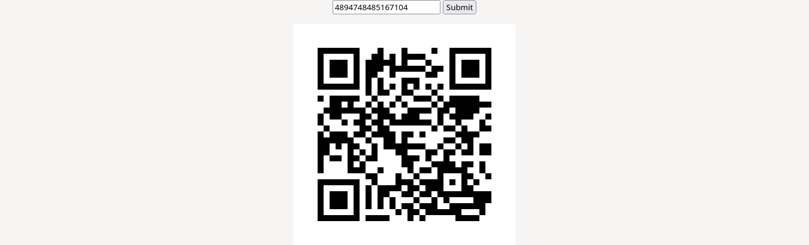
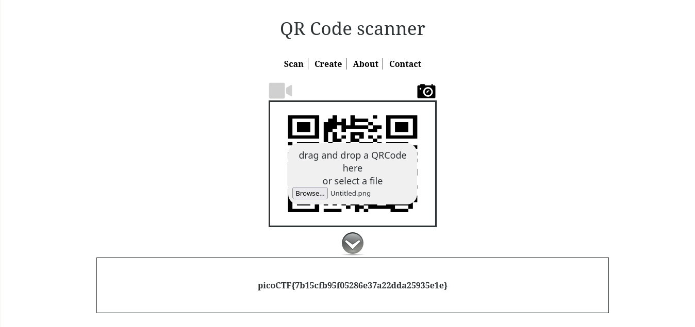

---
```
Author: John Johnson
Description
The image link appears broken... https://jupiter.challenges.picoctf.org/problem/58112 or http://jupiter.challenges.picoctf.org:58112
```
---

A new day, A new challenge to break into. Today I will be showing you how to solve the Java Script Kiddie from PicoCTF '19. Logging into the challenge we get a simple text field to enter text. When we try to enter anything into it we can see that a broken png appears below it. Looking at the pages source code using `ctrl+u` we can clearly see that there is some logic that we need to reverse enginner and understand.

## Understanding Javascript

```javascript
var bytes = [];
			$.get("bytes", function(resp) {
				bytes = Array.from(resp.split(" "), x => Number(x));
			});

			function assemble_png(u_in){
				var LEN = 16;
				var key = "0000000000000000";
				var shifter;
				if(u_in.length == LEN){
					key = u_in;
				}
				var result = [];
				for(var i = 0; i < LEN; i++){
					shifter = key.charCodeAt(i) - 48;
					for(var j = 0; j < (bytes.length / LEN); j ++){
						result[(j * LEN) + i] = bytes[(((j + shifter) * LEN) % bytes.length) + i]
					}
				}
				while(result[result.length-1] == 0){
					result = result.slice(0,result.length-1);
				}
				document.getElementById("Area").src = "data:image/png;base64," + btoa(String.fromCharCode.apply(null, new Uint8Array(result)));
				return false;
			}
```

We both will go through the code line by line and understand what does everything mean here.

```javascript
            var bytes = [];
			$.get("bytes", function(resp) {
				bytes = Array.from(resp.split(" "), x => Number(x));
			});
```

This code snippet begins by initialising an array called `bytes` and it is used to store the data retrived from the `/bytes` endpoint, split the array and convert each element into an array..

The `assemble_png(u_in)` contains the core logic. Here, It takes the user input from the previous textbox as an argument and some variables are initialised suck as `LEN`, `key` and `shifter`. The code next verifies if the `u_in`'s lenght is equal to 16, if it is then it will update the `key` value with the `u_in` otherwise it will remain default i.e. `0000000000000000`. Inside the function there is a for loop that iterates through each charecter in the `key` and for every charecter of the key, a shifter value is is calculated based on the ASCII code of the charecter minus 48. This is crucial as this allows us to find the offset in the byte arrays.

Another loop processes the chunk of bytes obtained from the server, The offset is adjusted based on the shifter value, creating room for PNG assembly and then finally renders that PNG, after removing the trailing zeros.

This questions the point that we need to bruteforce (10)^6 possible combinations. This would take an eternity to bruteforce and impractical, then we find a way to do it without the need of extensive bruteforcing.

## PNG Crash Course

A PNG stands for **P**ortable **N**etwork **G**raphics. It is a file format which allows lossless data compression. PNG supports palette-based images (with palettes of 24-bit RGB or 32-bit RGBA colors), grayscale images (with or without an alpha channel for transparency), and full-color non-palette-based RGB or RGBA images. The PNG working group designed the format for transferring images on the Internet, not for professional-quality print graphics; therefore, non-RGB color spaces such as CMYK are not supported. A PNG file contains a single image in an extensible structure of chunks, encoding the basic pixels and other information such as textual comments and integrity checks documented in RFC 2083.

PNG files have the ".png" file extension and the "image/png" MIME media type. PNG was published as an informational RFC 2083 in March 1997 and as an ISO/IEC 15948 standard in 2004.

But the intresting part that we require for this challenge is the PNG header also known as the PNG Signature. The image is broken becaue the header is shifted (let's call this corrupted header) using a key and we need to find the key that would let us get the header back in correct position so the image can be displayed correctly.





So, the expected header is `89 50 4E 47 0D 0A 1A 0A 00 00 00 0D 49 48 44 52`

## Building a Bruteforcer

So, We need to write a python script that would iterate through each byte in `bytes` endpoint and tries to iterate through every shift value and match the corrupted header to the expected header and then we can save the the value of each shifter when they both match and construct some valid keys.

```python
import itertools
import os

def find_key(expected_header, bytes_data):
    KEY_LEN = len(expected_header)
    shifters = [[] for _ in range(KEY_LEN)]     # A list to store the possible keys.

    for i in range(KEY_LEN):
        for shifter in range(10):   # So, we can iterate through (0-9)
            j = 0
            offset = (((j + shifter) * KEY_LEN) % len(bytes_data)) + i      # Calculate the offset based on the shifter and current position in the key
            if bytes_data[offset] == expected_header[i]:
                shifters[i].append(shifter)

    for p in itertools.product(*shifters):      # Iterating through all possible combinations of shift values for each pos.
        key = "".join(map(str, p))
        print("[!] Valid Key:", key)

def main():
    os.system("curl -L http://jupiter.challenges.picoctf.org:58112/bytes -o bytes > /dev/null 2>&1")    # Getting the bytes freshly from the website (if you are onwindows you can just comment this line and get your own bytes file)

    expected_header = [0x89, 0x50, 0x4E, 0x47, 0x0D, 0x0A, 0x1A, 0x0A, 0x00, 0x00, 0x00, 0x0D, 0x49, 0x48, 0x44, 0x52]

    with open("bytes") as f:
        bytes_data = list(map(int, f.read().split(" ")))

    find_key(expected_header, bytes_data)

if __name__ == "__main__":
    main()
```
The script iterates through possible key combinations, aligning the bytes to reconstruct the PNG header until a match with the expected header is found. 

```sh
(venv) [giraffe@arch python]$ python3 chall.py
[!] Valid Key: 4894748485167104
[!] Valid Key: 4894748485267104
[!] Valid Key: 4894748486167104
[!] Valid Key: 4894748486267104

```



Running the script yeilds us only 4 possible keys for the header and then we can manually test those 4 keys in the input. After trying all the four valid keys, one of the keys should assemble correctly into a QR code, which upon scanning will give us the final flag.



You can follow me on twitter: @Goofygiraffe06
